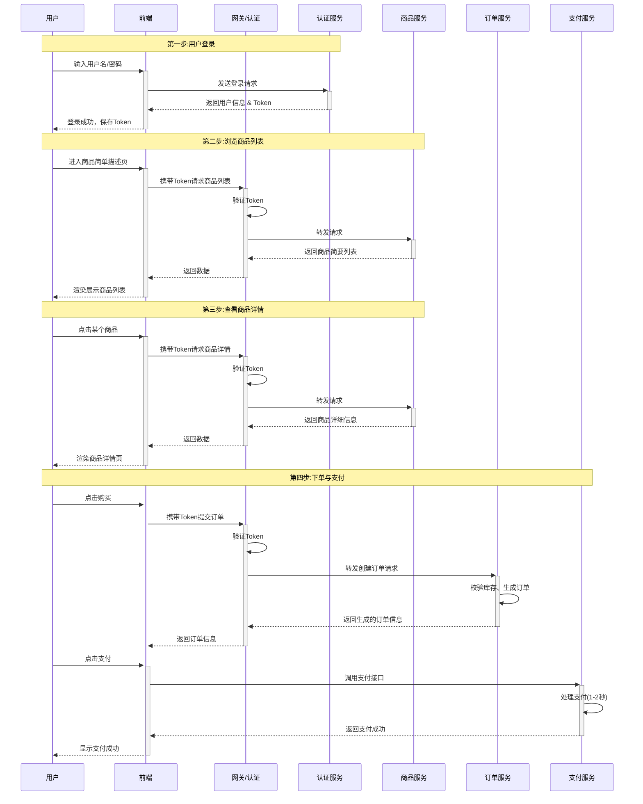

# 架构设计详解

## 项目概述

Velocity Data Domain 是一个专门针对高并发架构进行合理优化的框架。它基于领域驱动设计（DDD）原则，通过深入分析数据访问模式和业务场景，提供了一套完整的高性能数据处理方案。

在典型的高并发场景中，如电商秒杀、实时排行榜、热点数据查询等，传统的关系型数据库往往成为系统瓶颈。本项目通过一系列优化策略和技术手段，在保证数据一致性和系统可靠性的前提下，最大化系统吞吐量和响应速度。

## 整体架构

### 前置分析

首先我们仅针对当前场景，进行初步的流程分析:

1. 用户首先登录，获取用户信息、Token
2. 点进商品简单描述页
3. 随后选择某个商品，进入商品详情页
4. 选择购买，订单生成，支付成功

### 业务流程图

### 模块拆分

根据该流程图，我们可以直接进行模块拆分，我们采用DDD领域驱动设计，以提升模块的可迁移性:

- **认证服务**: user-auth-service 模块
- **用户个人信息服务**: user-profile-service 模块
- **商品信息服务**: product-profile-service 模块
- **订单服务**: order-service 模块
- **支付服务**: pay-service 模块