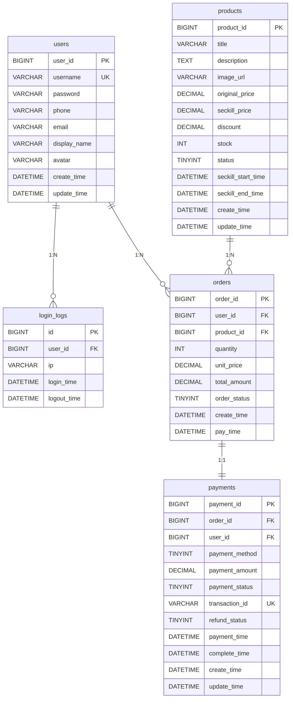

# 数据库表设计文档

## 概述

本文档详细描述了 Blaze Query 项目中使用的数据库表结构设计。根据领域驱动设计（DDD）的原则，我们将业务模型映射到数据库表结构中，确保数据的一致性和完整性。

## 数据库环境

- 数据库类型：MySQL 8.0+
- 字符集：utf8mb4
- 排序规则：utf8mb4_unicode_ci

## 表结构设计

### 1. 用户认证相关表

#### 1.1 用户表（users）

存储用户基本信息，用于用户认证和授权。

| 字段名          | 类型              | 空值 | 默认值               | 描述        |
|--------------|-----------------|----|-------------------|-----------|
| user_id      | BIGINT UNSIGNED | 否  | 无                 | 用户唯一标识，主键 |
| username     | VARCHAR(50)     | 否  | 无                 | 用户名，唯一    |
| password     | VARCHAR(255)    | 否  | 无                 | 加密后的密码    |
| phone        | VARCHAR(20)     | 是  | NULL              | 手机号码      |
| email        | VARCHAR(100)    | 是  | NULL              | 邮箱地址      |
| display_name | VARCHAR(100)    | 是  | NULL              | 显示名称/昵称   |
| avatar       | VARCHAR(255)    | 是  | NULL              | 头像URL     |
| create_time  | DATETIME        | 否  | CURRENT_TIMESTAMP | 创建时间      |
| update_time  | DATETIME        | 否  | CURRENT_TIMESTAMP | 更新时间      |

索引：
- 主键索引：user_id
- 唯一索引：username
- 普通索引：phone, email

#### 1.2 登录日志表（login_logs）

记录用户的登录日志信息。

| 字段名         | 类型              | 空值 | 默认值               | 描述      |
|-------------|-----------------|----|-------------------|---------|
| id          | BIGINT UNSIGNED | 否  | 无                 | 日志ID，主键 |
| user_id     | BIGINT UNSIGNED | 否  | 无                 | 关联的用户ID |
| ip          | VARCHAR(45)     | 是  | NULL              | 登录IP地址  |
| login_time  | DATETIME        | 否  | CURRENT_TIMESTAMP | 登录时间    |
| logout_time | DATETIME        | 是  | NULL              | 登出时间    |

索引：
- 主键索引：id
- 普通索引：user_id, login_time

### 2. 商品相关表

#### 2.1 商品表（products）

存储商品的基本信息和秒杀相关信息。

| 字段名                | 类型              | 空值 | 默认值               | 描述              |
|--------------------|-----------------|----|-------------------|-----------------|
| product_id         | BIGINT UNSIGNED | 否  | 无                 | 商品ID，主键         |
| title              | VARCHAR(200)    | 否  | 无                 | 商品标题            |
| description        | TEXT            | 是  | NULL              | 商品描述            |
| image_url          | VARCHAR(255)    | 是  | NULL              | 商品图片URL         |
| original_price     | DECIMAL(10,2)   | 否  | 0.00              | 商品原价            |
| seckill_price      | DECIMAL(10,2)   | 否  | 0.00              | 秒杀价格            |
| discount           | DECIMAL(3,2)    | 是  | NULL              | 折扣率             |
| stock              | INT             | 否  | 0                 | 商品库存            |
| status             | TINYINT         | 否  | 1                 | 商品状态（1-上架，0-下架） |
| seckill_start_time | DATETIME        | 是  | NULL              | 秒杀开始时间          |
| seckill_end_time   | DATETIME        | 是  | NULL              | 秒杀结束时间          |
| create_time        | DATETIME        | 否  | CURRENT_TIMESTAMP | 创建时间            |
| update_time        | DATETIME        | 否  | CURRENT_TIMESTAMP | 更新时间            |

索引：
- 主键索引：product_id
- 普通索引：status, seckill_start_time, seckill_end_time

### 3. 订单相关表

#### 3.1 订单表（orders）

存储订单的基本信息。

| 字段名          | 类型              | 空值 | 默认值               | 描述                      |
|--------------|-----------------|----|-------------------|-------------------------|
| order_id     | BIGINT UNSIGNED | 否  | 无                 | 订单ID，主键                 |
| user_id      | BIGINT UNSIGNED | 否  | 无                 | 用户ID                    |
| product_id   | BIGINT UNSIGNED | 否  | 无                 | 商品ID                    |
| quantity     | INT             | 否  | 1                 | 购买数量                    |
| unit_price   | DECIMAL(10,2)   | 否  | 0.00              | 下单时单价                   |
| total_amount | DECIMAL(10,2)   | 否  | 0.00              | 订单总金额                   |
| order_status | TINYINT         | 否  | 0                 | 订单状态（0-待付款，1-已付款，2-已取消） |
| create_time  | DATETIME        | 否  | CURRENT_TIMESTAMP | 创建时间                    |
| pay_time     | DATETIME        | 是  | NULL              | 支付时间                    |

索引：
- 主键索引：order_id
- 普通索引：user_id, product_id, order_status, create_time

### 4. 支付相关表

#### 4.1 支付记录表（payments）

存储支付相关信息。

| 字段名            | 类型              | 空值 | 默认值               | 描述                             |
|----------------|-----------------|----|-------------------|--------------------------------|
| payment_id     | BIGINT UNSIGNED | 否  | 无                 | 支付ID，主键                        |
| order_id       | BIGINT UNSIGNED | 否  | 无                 | 关联的订单ID                        |
| user_id        | BIGINT UNSIGNED | 否  | 无                 | 用户ID                           |
| payment_method | TINYINT         | 否  | 无                 | 支付方式（1-支付宝，2-微信，3-银行卡）         |
| payment_amount | DECIMAL(10,2)   | 否  | 0.00              | 支付金额                           |
| payment_status | TINYINT         | 否  | 0                 | 支付状态（0-待支付，1-支付成功，2-支付失败，3-退款） |
| transaction_id | VARCHAR(100)    | 是  | NULL              | 第三方支付流水号                       |
| refund_status  | TINYINT         | 否  | 0                 | 退款状态（0-无退款，1-部分退款，2-全额退款）      |
| payment_time   | DATETIME        | 是  | NULL              | 支付时间                           |
| complete_time  | DATETIME        | 是  | NULL              | 支付完成时间                         |
| create_time    | DATETIME        | 否  | CURRENT_TIMESTAMP | 创建时间                           |
| update_time    | DATETIME        | 否  | CURRENT_TIMESTAMP | 更新时间                           |

索引：
- 主键索引：payment_id
- 唯一索引：transaction_id
- 普通索引：order_id, user_id, payment_status

## 表关系图



## 初始化脚本

```sql
-- 创建数据库
CREATE DATABASE IF NOT EXISTS blaze_query DEFAULT CHARACTER SET utf8mb4 COLLATE utf8mb4_unicode_ci;

USE blaze_query;

-- 用户表
CREATE TABLE users (
    user_id BIGINT UNSIGNED NOT NULL AUTO_INCREMENT COMMENT '用户唯一标识',
    username VARCHAR(50) NOT NULL COMMENT '用户名',
    password VARCHAR(255) NOT NULL COMMENT '加密后的密码',
    phone VARCHAR(20) NULL DEFAULT NULL COMMENT '手机号码',
    email VARCHAR(100) NULL DEFAULT NULL COMMENT '邮箱地址',
    display_name VARCHAR(100) NULL DEFAULT NULL COMMENT '显示名称/昵称',
    avatar VARCHAR(255) NULL DEFAULT NULL COMMENT '头像URL',
    create_time DATETIME NOT NULL DEFAULT CURRENT_TIMESTAMP COMMENT '创建时间',
    update_time DATETIME NOT NULL DEFAULT CURRENT_TIMESTAMP ON UPDATE CURRENT_TIMESTAMP COMMENT '更新时间',
    PRIMARY KEY (user_id),
    UNIQUE KEY uk_username (username),
    KEY idx_phone (phone),
    KEY idx_email (email)
) ENGINE=InnoDB DEFAULT CHARSET=utf8mb4 COLLATE=utf8mb4_unicode_ci COMMENT='用户表';

-- 登录日志表
CREATE TABLE login_logs (
    id BIGINT UNSIGNED NOT NULL AUTO_INCREMENT COMMENT '日志ID',
    user_id BIGINT UNSIGNED NOT NULL COMMENT '关联的用户ID',
    ip VARCHAR(45) NULL DEFAULT NULL COMMENT '登录IP地址',
    login_time DATETIME NOT NULL DEFAULT CURRENT_TIMESTAMP COMMENT '登录时间',
    logout_time DATETIME NULL DEFAULT NULL COMMENT '登出时间',
    PRIMARY KEY (id),
    KEY idx_user_id (user_id),
    KEY idx_login_time (login_time)
) ENGINE=InnoDB DEFAULT CHARSET=utf8mb4 COLLATE=utf8mb4_unicode_ci COMMENT='登录日志表';

-- 商品表
CREATE TABLE products (
    product_id BIGINT UNSIGNED NOT NULL AUTO_INCREMENT COMMENT '商品ID',
    title VARCHAR(200) NOT NULL COMMENT '商品标题',
    description TEXT NULL COMMENT '商品描述',
    image_url VARCHAR(255) NULL DEFAULT NULL COMMENT '商品图片URL',
    original_price DECIMAL(10,2) NOT NULL DEFAULT 0.00 COMMENT '商品原价',
    seckill_price DECIMAL(10,2) NOT NULL DEFAULT 0.00 COMMENT '秒杀价格',
    discount DECIMAL(3,2) NULL DEFAULT NULL COMMENT '折扣率',
    stock INT NOT NULL DEFAULT 0 COMMENT '商品库存',
    status TINYINT NOT NULL DEFAULT 1 COMMENT '商品状态（1-上架，0-下架）',
    seckill_start_time DATETIME NULL DEFAULT NULL COMMENT '秒杀开始时间',
    seckill_end_time DATETIME NULL DEFAULT NULL COMMENT '秒杀结束时间',
    create_time DATETIME NOT NULL DEFAULT CURRENT_TIMESTAMP COMMENT '创建时间',
    update_time DATETIME NOT NULL DEFAULT CURRENT_TIMESTAMP ON UPDATE CURRENT_TIMESTAMP COMMENT '更新时间',
    PRIMARY KEY (product_id),
    KEY idx_status (status),
    KEY idx_seckill_start_time (seckill_start_time),
    KEY idx_seckill_end_time (seckill_end_time)
) ENGINE=InnoDB DEFAULT CHARSET=utf8mb4 COLLATE=utf8mb4_unicode_ci COMMENT='商品表';

-- 订单表
CREATE TABLE orders (
    order_id BIGINT UNSIGNED NOT NULL AUTO_INCREMENT COMMENT '订单ID',
    user_id BIGINT UNSIGNED NOT NULL COMMENT '用户ID',
    product_id BIGINT UNSIGNED NOT NULL COMMENT '商品ID',
    quantity INT NOT NULL DEFAULT 1 COMMENT '购买数量',
    unit_price DECIMAL(10,2) NOT NULL DEFAULT 0.00 COMMENT '下单时单价',
    total_amount DECIMAL(10,2) NOT NULL DEFAULT 0.00 COMMENT '订单总金额',
    order_status TINYINT NOT NULL DEFAULT 0 COMMENT '订单状态（0-待付款，1-已付款，2-已取消）',
    create_time DATETIME NOT NULL DEFAULT CURRENT_TIMESTAMP COMMENT '创建时间',
    pay_time DATETIME NULL DEFAULT NULL COMMENT '支付时间',
    PRIMARY KEY (order_id),
    KEY idx_user_id (user_id),
    KEY idx_product_id (product_id),
    KEY idx_order_status (order_status),
    KEY idx_create_time (create_time)
) ENGINE=InnoDB DEFAULT CHARSET=utf8mb4 COLLATE=utf8mb4_unicode_ci COMMENT='订单表';

-- 支付记录表
CREATE TABLE payments (
    payment_id BIGINT UNSIGNED NOT NULL AUTO_INCREMENT COMMENT '支付ID',
    order_id BIGINT UNSIGNED NOT NULL COMMENT '关联的订单ID',
    user_id BIGINT UNSIGNED NOT NULL COMMENT '用户ID',
    payment_method TINYINT NOT NULL COMMENT '支付方式（1-支付宝，2-微信，3-银行卡）',
    payment_amount DECIMAL(10,2) NOT NULL DEFAULT 0.00 COMMENT '支付金额',
    payment_status TINYINT NOT NULL DEFAULT 0 COMMENT '支付状态（0-待支付，1-支付成功，2-支付失败，3-退款）',
    transaction_id VARCHAR(100) NULL DEFAULT NULL COMMENT '第三方支付流水号',
    refund_status TINYINT NOT NULL DEFAULT 0 COMMENT '退款状态（0-无退款，1-部分退款，2-全额退款）',
    payment_time DATETIME NULL DEFAULT NULL COMMENT '支付时间',
    complete_time DATETIME NULL DEFAULT NULL COMMENT '支付完成时间',
    create_time DATETIME NOT NULL DEFAULT CURRENT_TIMESTAMP COMMENT '创建时间',
    update_time DATETIME NOT NULL DEFAULT CURRENT_TIMESTAMP ON UPDATE CURRENT_TIMESTAMP COMMENT '更新时间',
    PRIMARY KEY (payment_id),
    UNIQUE KEY uk_transaction_id (transaction_id),
    KEY idx_order_id (order_id),
    KEY idx_user_id (user_id),
    KEY idx_payment_status (payment_status)
) ENGINE=InnoDB DEFAULT CHARSET=utf8mb4 COLLATE=utf8mb4_unicode_ci COMMENT='支付记录表';
```

## 设计原则

1. **一致性**：表结构设计与领域模型保持一致
2. **可扩展性**：预留适当的扩展字段，便于未来功能迭代
3. **性能优化**：合理设置索引，提高查询效率
4. **安全性**：敏感信息如密码进行了加密处理
5. **标准化**：遵循数据库设计三大范式，适当冗余以提高查询性能

## 版本历史

| 版本   | 修改日期       | 修改内容 |
|------|------------|------|
| v1.0 | 2025-10-09 | 初始版本 |